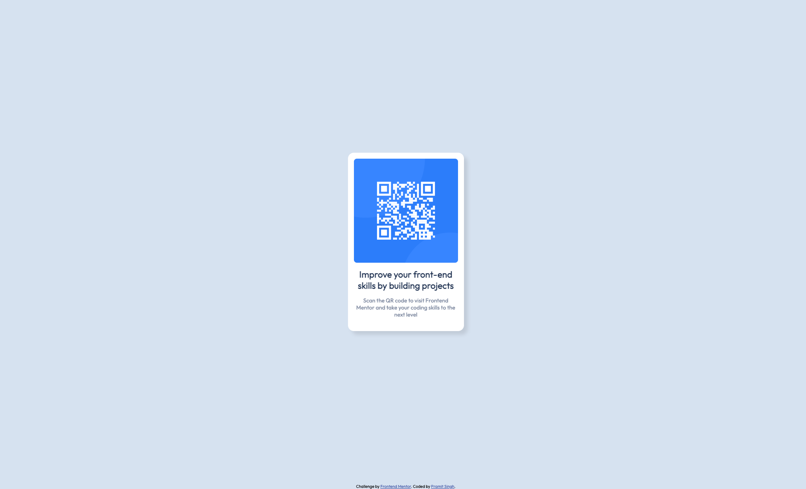
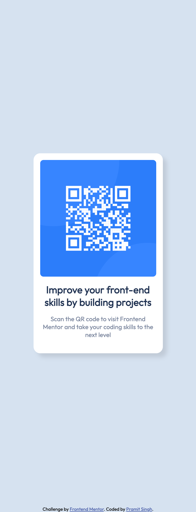

# QR Code Component

A solution to the [Frontend Mentor QR code component challenge](https://www.frontendmentor.io/challenges/qr-code-component-iux_sIO_H), built with HTML and CSS. The page displays a centered card with a QR code, heading, and description.

## Screenshots

### Desktop

### Mobile

## Built with

- HTML5
- CSS Flexbox for centering the card and arranging its content
- Relative units (`rem` and `%`) for sizing and spacing
- Outfit font from Google Fonts

## View locally

Download or clone this repository, then open `index.html` in your browser. No installation or build step is required. An internet connection is needed to load the Google Font.

## Author

Built by Pramit Singh.

- [GitHub repository](https://github.com/pramitsingh0/qr-code-fe)
